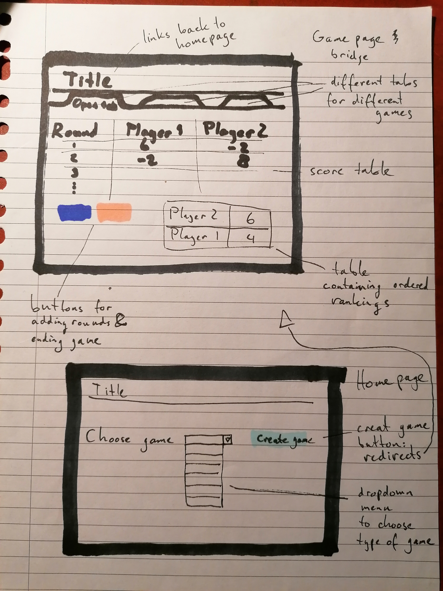

# Scoresheets
### The easiest way to keep score during cardgames!

What makes cardgames so popular? It is probably the fact that they are well known and that you don't need to have much with you to play them.
In fact, for most games one might only need to have a deck of cards. For some, however, one also needs something to keep score with,
be it a pen and a piece of paper or a very easy-to-use web application!

In this web application, one can choose between multiple tabs containing different cardgames.
On these tabs, specifically designed for these games, it will be very easy for the user to track scores.
The app will also contain some custom scoresheets, which can be used when players require a different way to track scores.

## Prerequisites

* Data sources:
* External components: 
    * Some package to manage a database: SQL and flask, including extra flask modules
    * bootstrap for designing properties and buttons
* The hardest part of the application will to implement a database which stores game scores.

## Sketch

The application will have a homepage where one can choose the type of game.

A simple bridge scoresheet will have the user input all players guesses and actual wins. Scores will be calculated automatically.

All pages will include a rankings table, where the players total points are shown in order of ranking. The scoresheet for toepen will look something like this.

The application will support mobile!

