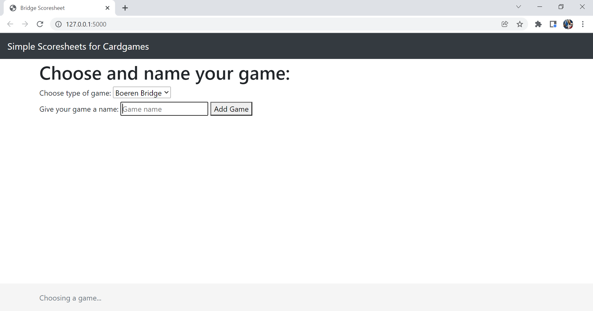
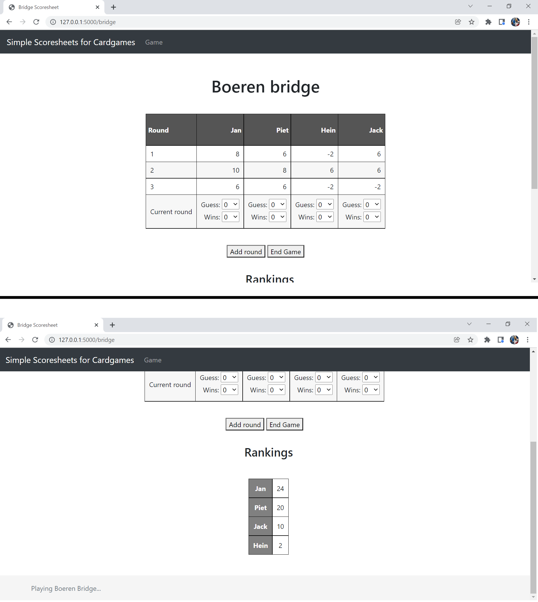
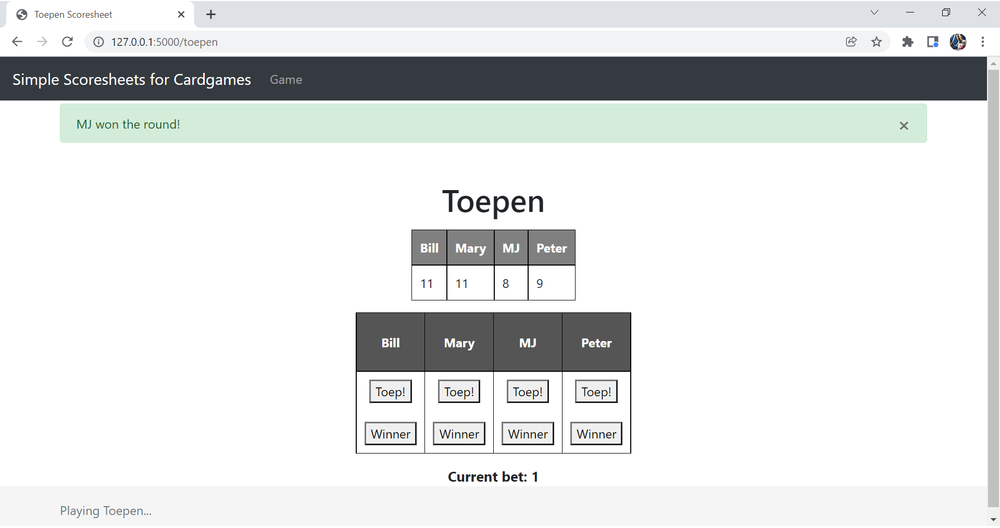
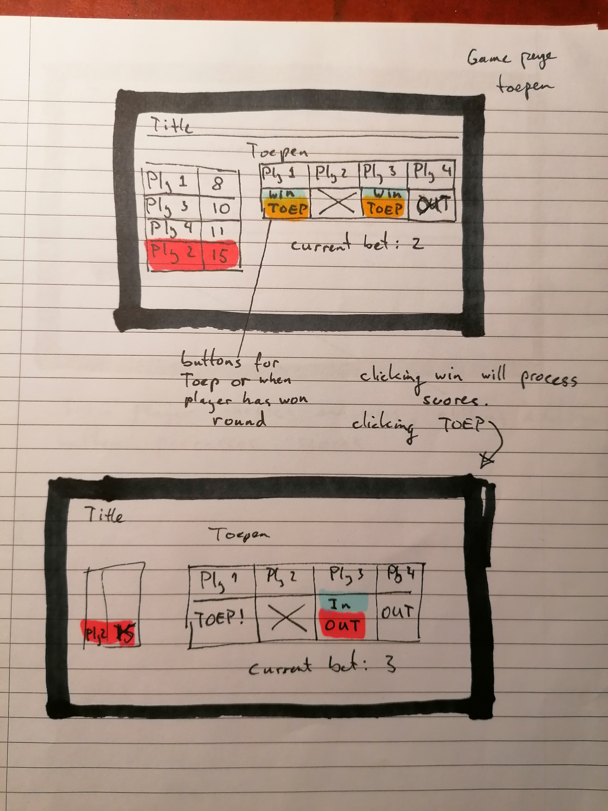

# Scoresheets
### The easiest way to keep score during cardgames!

What makes cardgames so popular? It is probably the fact that they are well known and that you don't need to have much with you to play them.
In fact, for most games one might only need to have a deck of cards. For some, however, one also needs something to keep score with,
be it a pen and a piece of paper or a very easy-to-use web application!

In this web application, one can choose between multiple tabs containing different cardgames.
On these tabs, specifically designed for these games, it will be very easy for the user to track scores.


## Author

- [@Lancelot81](https://www.github.com/Lancelot81)


## Deployment

Their are multiple ways to run this project. First of all, the project can be found on [my website](https://lanceops.northeurope.cloudapp.azure.com), but the server might not always be running.

Other ways to deploy this project are:
* Using Flask: `flask run scoresheet`
* Using Python: `python main.py`
* Using docker: the image can be pulled using `docker pull lance81/cardgame-scoresheets`, it can be run locally using the `docker run` command.


## Prerequisites

* Data sources:
* External components: 
    * Some package to manage a database: SQL and flask, including extra flask modules
    * bootstrap for designing properties and buttons
* The hardest part of the application will to implement a database which stores game scores.
* A similar scorsheets web application is has been made for [dice games](http://www.playonlinedicegames.com/scoresheet). However, it does not make use of a database for scores, thus scores are lost after page refresh. A simple scoresheet application can also be found in the [Play Store](https://play.google.com/store/apps/details?id=de.einedigitalewelt.spielblock&hl=nl&gl=US), but it requires the user to download an app.


## Repository structure
```
 .
 ┣ doc
 ┃ ┣ Bridge.png
 ┃ ┣ Homepage.png
 ┃ ┣ projectSketch1.jpg
 ┃ ┣ projectSketch2.jpg
 ┃ ┣ projectSketch3.jpg
 ┃ ┣ projectSketch4.jpg
 ┃ ┗ Toepen.png
 ┣ scoresheet
 ┃ ┣ static
 ┃ ┃ ┣ css
 ┃ ┃ ┃ ┣ sticky-footer-navbar.css
 ┃ ┃ ┃ ┗ table.css
 ┃ ┃ ┗ js
 ┃ ┃ ┃ ┗ tablebb.js
 ┃ ┣ templates
 ┃ ┃ ┣ base.html
 ┃ ┃ ┣ bridge.html
 ┃ ┃ ┣ home.html
 ┃ ┃ ┗ toep.html
 ┃ ┣ models.py
 ┃ ┣ views.py
 ┃ ┗ __init__.py
 ┣ ASSESSMENT.md
 ┣ Dockerfile
 ┣ LICENSE
 ┣ main.py
 ┣ README.md
 ┣ requirements.txt
 ┗ REVIEW.md
```


## The application (screenshots)
The application contains three different pages:
* The Homepage


* A page for Bridge


* A page for Toepen



## Acknowledgements

 - [Responsice HTML tables](https://www.redips.net/javascript/adding-table-rows-and-columns/)
 - [Awesome Python Website tutorial on YouTube](https://www.youtube.com/watch?v=dam0GPOAvVI)
 - Special thanks to [Quinten van der Post](https://github.com/Qvdpost) for supervising me during this project!


## Sketch

The following sketches were made during the early stages of the project.

The application will have a homepage where one can choose the type of game.


A simple bridge scoresheet will have the user input all players guesses and actual wins. Scores will be calculated automatically.


All pages will include a rankings table, where the players total points are shown in order of ranking. The scoresheet for toepen will look something like this.



The application will support mobile!


